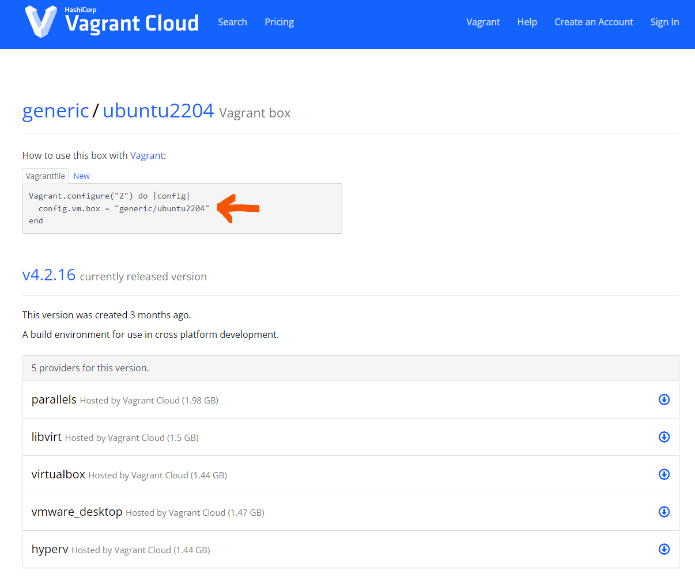
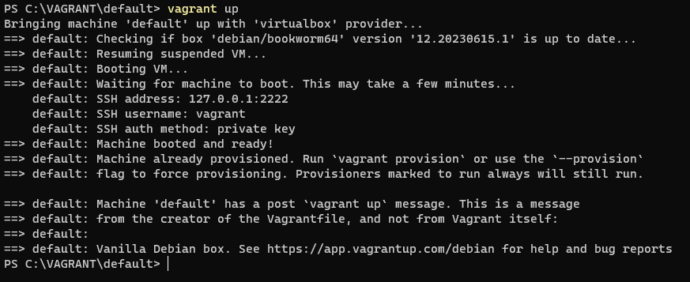
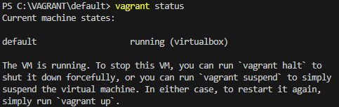
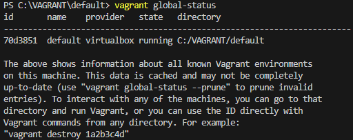
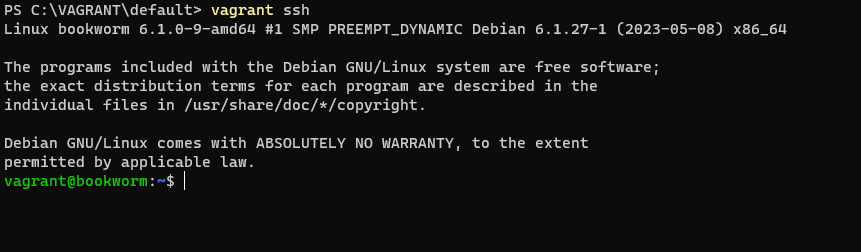
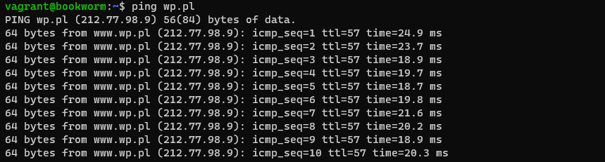

---

title: Vagrant
author: Grzegorz Adamczyk
theme: default
class: 


marp: true

---
<style>
section { justify-content: start; }
p {
  font-size: 1em;
}

img[alt~="center"] {
  display: block;
  margin: 0 auto;
}
</style>


# Vagrant w 10 minut
autor: Grzegorz Adamczyk

---
# Czym jest Vagrant?

**Vagrant to narzędzie, które pozwala zautomatyzować zarządzanie środowiskami wirtualnymi.**

Umożliwia tworzenie maszyn wirtualnych na podstawie pliku konfiguracyjnego. Sam nie dostarcza mechanizmów wirtualizacyjnych, wymaga do działania zewnętrznych dostawców (providerów). Domyślnym i najpopulrniejszym jest VirtualBox.

---
# Do czego można wykorzystać Vagrant
**Świetnie nadaje się do tworzenia, zarządzania i dystrybucji przenośnych środowisk developerskich.**
* Używanie kilku środowisk developerskich na jednej maszynie fizycznej tworzy wiele problemów. Zamiast instalować wszystkie aplikacje na jednej maszynie fizycznej, lepiej użyć maszyn wirtualnych. Vagrant ułatwia  konfigurowanie środowisk złożonych z wielu maszyn wirtualnych 
* Raz stworzoną konfigurację maszyn można łatwo uruchomić na dowolnej maszynie fizycznej na której jest zainstalowany Vagrant

---
# Dlaczego Vagrant

- **Skalowalność**: możemy tworzyć zarówno pojedyncze maszyny jak i złożone środowiska
- **Automatyzacja i przyspieszenie tworzenia maszyn wirtualnych**: Vagrant oferuje gotowe obrazy zamiast instalacji systemu, raz pobrany obraz przechowywany jest w lokalnym repozytorium i może być wykorzystywany wielokrotnie bez konieczności ponownego pobierania
- **Gotowe obrazy**: duży wybór obrazów dla domyślnego providera (VirtualBox)
- **Wsparcie dla różnych dostawców wirtualizacji**: Vagrant potrafi  współpracować z VirtualBox, HyperV, vSphere, Docker, Xen, Aws ....

---
# Dlaczego Vagrant
- **Niska bariera wejścia**: minimalny plik konfiguracyjny to 3 linijki, maszyna zbudowana według ustawień domyślnych posiada możliwość zalogowania po ssh, dostęp do internetu oraz  współdzielony folder do wymiany plików z hostem gospodarza

- **Podejście Infrastructure As a Code**: pracujemy z tekstowym plikiem konfiguracyjnym zamiast z GUI i myszką. Raz stworzoną konfigurację można wykorzystywać wielokrotnie, plikami można zarządzać przy pomocy systemu kontroli wersji (np. git)
- **Współpraca z różnymi systemami operacyjnymi**: Vagrant działa na Windows, Linux, OS X

---
# Jak stworzyć i uruchomić maszynę wirtualną?
## Tworzymy plik konfiguracyjny w którym definiujemy:
- **system operacyjny, który chcemy uruchomić**: wskazujemy nazwę tzw. pudełka
- **konfigurację sprzętową maszyny**: procesor, pamięć, dyski (to na co pozwala dany provider)    
- **konfigurację sieci**
- **provisioning**: jakie polecenie lub skrypt ma zostać uruchomiony po starcie maszyny witrualnej. Obsługiwane są również takie narzędzia jak Ansible, Pupet, Salt

Jeżeli nie wskażemy konkretnej konfiguracji, zostaną użyte wartości domyślne. Jedyne ustawienie, którego nie można pominąć to nazwa pudełka

---
# Pudełka (Boxes)

Pudełko w Vagrancie to gotowy do uruchomienia obraz systemu operacyjnego

## Skąd wziąć pudełka?
Potrzebujemy tylko nazwę pudełka, Vagrant sam pobierze wszystkie potrzebne pliki

Dostępne pudełka możemy wyszukać na stronie Vagrant Cloud: https://app.vagrantup.com/boxes/search


---


---
# Co wtedy gdy nie ma pudełka takiego jak chcemy?


- Vagrant daje możliwość tworzenia własnych pudełek
- Udostępnia w tym celu narzędzie Packer: https://www.packer.io/
- Gotowe pudełko możemy umieścić na stronie Vagrant Cloud tak, aby mogli z niego inni

---
# Tworzymy pierwszą maszynę
## najprostszy plik konfiguracyjny

```````
Vagrant.configure("2") do |config|
  config.vm.box = "debian/bookworm64"
end
```````
Do tworzenia plików konfiguracyjnych vagranta używana jest składnia języka Ruby

---
# Domyślny plik konfiguracyjny
## Alternatywa do budowania własnego pliku od podstaw

Kiedy chcemy skorzystać z gotowego szablonu pliku konfiguracyjnego, możemy wykorzystać polecenie ```vagrant init```

Polecenie stworzy plik o nazwie Vagrantfile w bieżącym katalogu. Plik zawiera przykładową konfigurację zabezpieczoną przed wykonaniem komentarzami. Aby skorzystać z wybranych ustawień, należy usunąć komentarze z początków linii.

---
# Uruchamiamy pierwszą maszynę

Przechodzimy do katalogu z naszym plikiem Vagrantfile i uruchamiamy maszynę:

```
vagrant up
```



---
# Sprawdzamy czy maszyna uruchomiła się

```
vagrant status
```



---
# Szczegółowe informacje o wszystkich maszynach

```
vagrant global-status
```



---
# Logujemy się do maszyny

```
vagrant ssh
```


---
# Testujemy internet

W domyślnej konfiguracji maszyna wirtualna posiada dostęp do internetu

```
ping wp.pl
```


---
# Sieć
Jeżeli używamy VirtualBox jako providera, domyślnie po stronie VirtualBox tworzona jest sieć typu NAT
* Maszyna ma adres ip 
* Maszyna ma dostęp do internetu 
---
# Testujemy folder współdzielony z hostem gospodarza

Bieżący folder z konfiguracją Vagranta jest domyślnie mapowany wewnątrz maszyny wirtualnej na folder /vagrant
Dzięki temu możemy w prosy sposób wymieniać pliki między hostem gospodarza a maszyną wirtualną

```
ls /vagrant
```
---
# Kończymy pracę z maszyną
## Wychodzimy z sesji ssh
```
exit
```
## Zatrzymujemy maszynę
```
vagrant halt
```
## Niszczymy maszynę
```
vagrant destroy
```